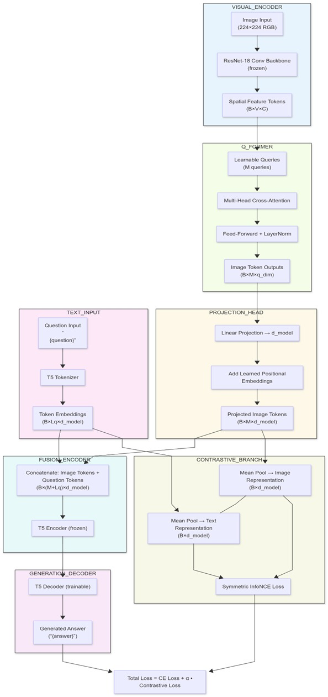
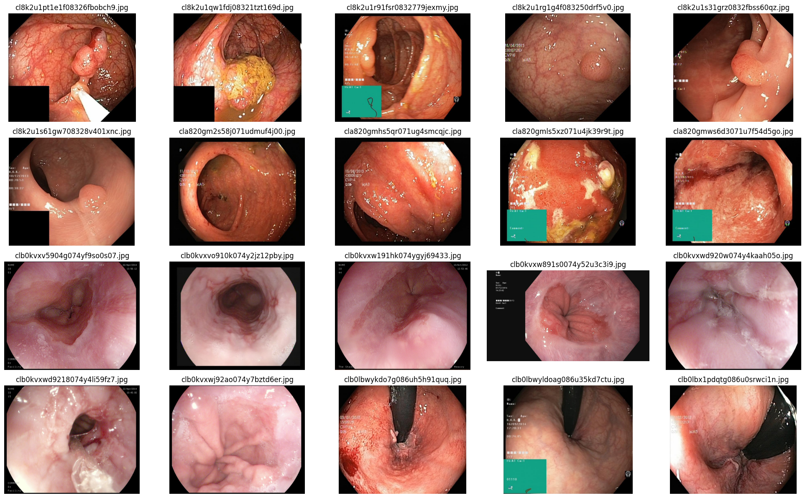

# MedVQA: Efficient BLIP-2 Inspired Multimodal Transformer

> A lightweight vision-language model (VLM) engineered for medical visual question answering on gastrointestinal endoscopy images, optimized to train and infer on a constrained 8GB GPU.

## 📖 Overview

Medical visual question answering (MedVQA) is a challenging task due to high intra-class variability, subtle visual cues, and the need for domain-specific clinical knowledge[cite: 1]. State-of-the-art multimodal models often suffer from computational bloat, making them difficult to deploy in resource-constrained clinical settings[cite: 1]. 

This project solves this by proposing a novel, lightweight adaptation of the BLIP-2 architecture[cite: 1]. By keeping the heavy image and text backbones completely frozen and training only a compact query transformer (Q-Former) and decoder, the model delivers expert-level clinical reasoning while remaining computationally efficient[cite: 1, 5].

---

## 🧠 Model Architecture



The architecture bridges visual and textual modalities using a highly efficient fusion strategy:

*   **Visual Encoder (Frozen):** A pre-trained ResNet-18 backbone extracts rich spatial feature maps from the endoscopy images[cite: 1, 5]. The fully connected classification head is removed to output spatial tokens[cite: 1].
*   **Q-Former (Trainable Bridge):** A lightweight Multi-Head Cross-Attention module that distills high-dimensional visual features into a compact set of learned queries[cite: 1, 5].
*   **Projection Head:** Aligns the Q-Former's output dimensions into the embedding space of the T5 language model[cite: 1, 5].
*   **T5 Language Model:** Uses a T5-small tokenizer and frozen encoder to process fused image and text embeddings[cite: 1, 5]. The T5 decoder remains fully trainable for autoregressive clinical answer generation[cite: 1, 5].

### ⚖️ Optimization & Loss Strategy
The model is jointly optimized using two loss functions:
1.  **Cross-Entropy Loss:** For supervised sequence generation of clinically validated answers[cite: 1].
2.  **Symmetric InfoNCE Contrastive Loss:** Applied to the pooled image and text representations to strengthen cross-modal semantic alignment and grounding[cite: 1, 6, 7].

To operate strictly within an 8GB VRAM limit, the training recipe utilizes **Automatic Mixed-Precision (AMP)**, **Gradient Accumulation**, and selective module freezing[cite: 1, 6].

---

## 📁 Repository Structure

```text
MEDICAL_VQA/
├── images/
│   └── image.png                # Sample predictions and outputs
├── jupyter_code/
│   └── prj_4_2.ipynb            # Exploratory data analysis and prototyping 
├── architecture.jpeg            # System architecture diagram
├── data_extractor.py            # Automated dataset downloading and cleaning
├── dataloader.py                # Dataset class, transforms, and batch collation
├── inference.ipynb              # Notebook for running model predictions
├── model.py                     # PyTorch implementation of ResNet, QFormer, and BLIP2_T5
├── train.py                     # Main training loop with mixed-precision and evaluation
└── utils.py                     # Loss functions, metrics (ROUGE-L, EM), and checkpointing
```

### File Details:
*   `data_extractor.py`: Connects to the Hugging Face hub to download the Kvasir-VQA-x1 subset[cite: 2]. It handles varied image formats and computes MD5 hashes to eliminate duplicate image content[cite: 1, 2].
*   `dataloader.py`: Implements the `KvasirVQADataset` with PyTorch. It applies training augmentations (RandomResizedCrop, RandomHorizontalFlip) and prevents data leakage by ensuring strict image-level train/validation splitting[cite: 1, 3].
*   `model.py`: Contains the `BLIP2_T5` model wiring, freezing the ResNet-18 and T5 encoder while leaving the Q-Former and decoder trainable[cite: 5].
*   `train.py`: Handles the end-to-end training process, integrating contrastive loss, learning rate scheduling, gradient clipping, and validation tracking[cite: 6].
*   `utils.py`: Contains the mathematical implementation of the `symmetric_contrastive_loss`, as well as `rouge_l_score` and `exact_match` evaluation metrics[cite: 7].

---

## 📊 Dataset

The model is trained on a curated subset of the **Kvasir-VQA-x1** dataset[cite: 1]. 
*   Contains over 142,000 normalized question-answer pairs linked to ~6,300 unique gastrointestinal endoscopy images[cite: 1, 2].
*   Questions require identifying anatomical landmarks, polyps, instruments, and pathologies[cite: 1].

---

## 🚀 Results & Impact

The model demonstrates strong generalization to unseen clinical images, successfully generating contextually accurate, descriptive medical phrasing.

*   **Best Validation Loss:** ~0.5416[cite: 1]
*   **ROUGE-L Score:** 0.6186 (Indicating high semantic and structural overlap with expert clinician answers)[cite: 1]
*   **Exact Match (EM):** 0.1406[cite: 1]

### Example Output


> *Observation:* The model successfully maintains clinical terminology, diagnostic keywords, and anatomical descriptors with high semantic fidelity, proving the efficiency of the Q-Former approach in medical reasoning[cite: 1].
